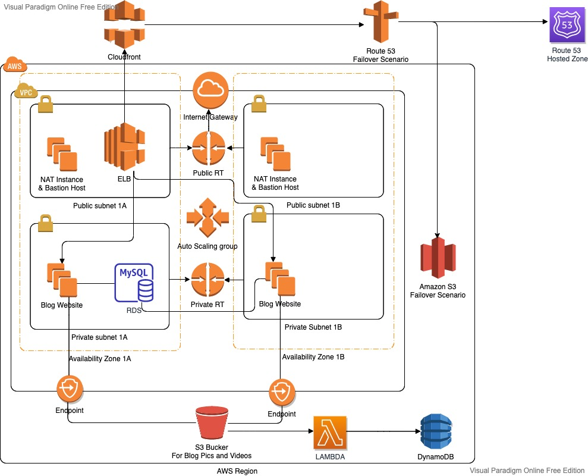
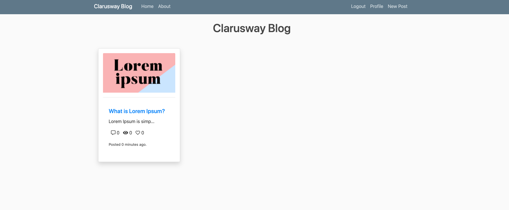

# AWS Blog Platform — Production-Grade Django Deployment on AWS

A full-stack blog application deployed on a secure, highly available AWS infrastructure featuring auto scaling, CDN distribution, DNS failover, and event-driven serverless processing.



---

## Overview

This project demonstrates end-to-end cloud infrastructure design and deployment for a Django web application. The architecture is built from scratch — custom VPC, multi-AZ networking, load balancing, auto scaling, and a serverless media-tracking pipeline — following AWS Well-Architected Framework principles around security, reliability, and operational excellence.

The application allows users to register, write blog posts, and upload images. All user data is persisted in a managed MySQL database, media files are stored in S3, and every upload event is automatically recorded in DynamoDB via a Lambda trigger.

---

## Architecture



```
Internet
   │
   ▼
Route 53 (Failover)
   ├── Primary  → CloudFront → ALB → EC2 (Private Subnet, ASG)
   │                                      │
   │                              RDS MySQL (Private Subnet)
   │                              S3 (via VPC Endpoint)
   │
   └── Secondary → S3 Static Website (maintenance page)
```

**Traffic flow:**
- All HTTP traffic is redirected to HTTPS at the ALB listener
- CloudFront sits in front of the ALB, terminating TLS with an ACM certificate
- Route 53 health check monitors CloudFront; on failure it fails over to an S3 static maintenance page
- EC2 instances in private subnets communicate with S3 through a VPC Gateway Endpoint, keeping traffic off the public internet

---

## AWS Services Used

| Layer | Service | Purpose |
|---|---|---|
| Networking | VPC, Subnets, IGW, NAT Instance, Route Tables, Endpoints | Isolated multi-AZ network |
| Compute | EC2 (Ubuntu 24.04), Launch Template, Auto Scaling Group | Scalable app servers |
| Load Balancing | Application Load Balancer, Target Group | Traffic distribution + health checks |
| Database | RDS MySQL 8.0 | Persistent user and blog data |
| Storage | S3 (2 buckets) | Media uploads + failover static site |
| CDN | CloudFront | Global caching, HTTPS termination |
| DNS | Route 53 | Failover routing policy |
| Serverless | Lambda (Python), DynamoDB | Event-driven S3 object tracking |
| Security | ACM, SSM Parameter Store, IAM Roles, Security Groups | Secrets management, least-privilege access |

---

## Key Design Decisions

**Secrets management via SSM Parameter Store**
Database credentials, the Django secret key, and the GitHub deploy token are stored as `SecureString` parameters in SSM, encrypted by KMS. The EC2 userdata script fetches them at boot and writes them to a `chmod 600` environment file loaded by the systemd service. No secrets appear in the codebase or environment variables visible to other processes.

**No SSM calls at Django startup**
An earlier pattern made SSM calls directly inside `settings.py` at import time. This caused the application to crash before serving any request if SSM was unreachable, failing ALB health checks and preventing ASG instances from ever becoming healthy. The fix moves all secret fetching to the userdata script, so Django starts clean from environment variables.

**Gunicorn + systemd instead of `runserver`**
`runserver` blocks the userdata script, which prevents the instance from signalling completion to the ASG. Gunicorn runs as a systemd service: it survives crashes, restarts automatically, and returns control to the script immediately so the instance can register with the target group.

**S3 VPC Gateway Endpoint**
EC2-to-S3 traffic routes through an endpoint attached to the private route table. This avoids NAT charges, reduces latency, and ensures media upload traffic never traverses the public internet.

**Multi-AZ private subnets for compute and RDS**
All EC2 instances and the RDS instance run in private subnets across two Availability Zones. Only the ALB and NAT instance are in public subnets. The RDS security group allows inbound traffic only from the EC2 security group on port 3306.

**Event-driven media tracking**
An S3 event notification triggers a Lambda function on every object upload. Lambda records the filename, event type, and timestamp to a DynamoDB table — providing a queryable audit log of all media without modifying the Django application.

---

## Tech Stack

- **Backend:** Python 3.12, Django 4.2, Gunicorn
- **Database:** MySQL 8.0 (AWS RDS)
- **Storage:** AWS S3 (`django-storages`, `boto3`)
- **Infrastructure:** AWS (VPC, EC2, ALB, ASG, RDS, S3, CloudFront, Route 53, Lambda, DynamoDB, SSM, ACM, IAM)
- **Process management:** systemd
- **Config management:** `python-decouple`
- **Version control:** Git / GitHub

---

## Local Development Setup

**Prerequisites:** Python 3.12+, MySQL

```bash
git clone https://github.com/your-github-username/andre-caps-aws.git
cd andre-caps-aws

python3 -m venv venv
source venv/bin/activate
pip install -r requirements.txt

cp .env.example .env
# Fill in .env with your local DB credentials and a generated secret key
```

Generate a Django secret key:
```bash
python3 -c "from django.core.management.utils import get_random_secret_key; print(get_random_secret_key())"
```

Run the app:
```bash
cd src
python3 manage.py migrate
python3 manage.py runserver
```

---

## Deployment (AWS)

The `userdata.sh` script fully automates instance configuration on first boot:

1. Installs system dependencies and creates a Python virtual environment
2. Clones this repository using a GitHub token fetched from SSM
3. Fetches all secrets from SSM Parameter Store and writes `/etc/blog.env`
4. Runs `collectstatic` and `migrate`
5. Installs and starts the Gunicorn systemd service on port 80

**SSM parameters required** (replace `yourname` with your SSM path prefix):

| Parameter | Type | Description |
|---|---|---|
| `/yourname/capstone/token` | SecureString | GitHub personal access token |
| `/yourname/capstone/secret_key` | SecureString | Django secret key |
| `/yourname/capstone/db_host` | String | RDS endpoint |
| `/yourname/capstone/username` | SecureString | RDS master username |
| `/yourname/capstone/password` | SecureString | RDS master password |
| `/yourname/capstone/s3_bucket` | String | S3 bucket name for media |

The EC2 IAM instance profile requires: `AmazonS3FullAccess`, `AmazonSSMReadOnlyAccess`.

---

## Security Highlights

- No credentials in source code or git history
- All secrets encrypted at rest with KMS via SSM SecureString
- EC2 instances in private subnets — no direct internet exposure
- ALB enforces HTTPS; HTTP is permanently redirected (301)
- RDS accessible only from EC2 security group on port 3306
- S3 traffic stays within the AWS network via VPC endpoint
- IAM roles follow least-privilege principle
